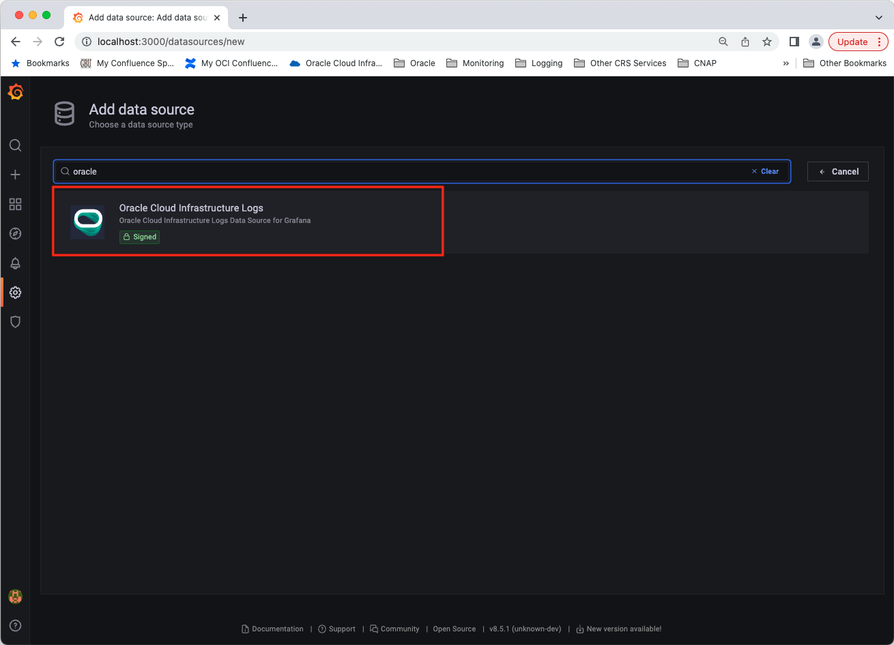

# Oracle Kubernetes Engine Installation - Oracle Cloud Infrastructure Data Source for Grafana

## Pre-requisites:

* [Oracle Container Engine for Kubernetes (OKE)](http://www.oracle.com/webfolder/technetwork/tutorials/obe/oci/oke-full/index.html)
* [Kubectl 1.7.4](https://kubernetes.io/docs/tasks/tools/install-kubectl/)
* [Helm](https://github.com/kubernetes/helm#install) 

## Background

Grafana is a popular technology that makes it easy to visualize logs and metrics. The [Oracle Cloud Infrastructure Logs Data Source for Grafana](https://grafana.com/grafana/plugins/oci-logs-datasource/) is used to extend Grafana by adding OCI Logging as a data source. The plugin enables you to visualize log records (service, audit, and custom) and metrics derived from log records stored in the OCI Logging service.

This walkthrough is intended for use by people who would like to deploy Grafana and the OCI Logs Data Source for Grafana in a Kubernetes environment.

Make sure you have access to the [Logging Service](https://docs.oracle.com/en-us/iaas/Content/Logging/Concepts/loggingoverview.htm) and that the logs you want to observe and analyze are being collected in your tenancy. See the OCI Logging documentation for information on how to collect or access:
* [Logs from your compute instances](https://docs.oracle.com/en-us/iaas/Content/Logging/Concepts/agent_management.htm)
* [Custom logs from your application/services](https://docs.oracle.com/en-us/iaas/Content/Logging/Concepts/custom_logs.htm)
* [OCI service logs](https://docs.oracle.com/en-us/iaas/Content/Logging/Concepts/service_logs.htm).

## Configuring the OCI Identity policies

In order to use the the OCI Logging Data Source for Grafana on OKE, the first step is to create a [dynamic group](https://docs.cloud.oracle.com/iaas/Content/Identity/Tasks/managingdynamicgroups.htm) used to group virtual machine or bare metal compute instances as “principals” (similar to user groups). Create a dynamic group that corresponds to all of your OKE worker nodes:

   

Next, create a [policy](https://docs.cloud.oracle.com/iaas/Content/Identity/Concepts/policygetstarted.htm), for example named “grafana_policy”, in the root compartment of your tenancy to permit instances in the dynamic group to make API calls against Oracle Cloud Infrastructure services. Add the following policy statements:

* `allow dynamicgroup grafana to read read log-groups in tenancy`
* `allow dynamicgroup grafana to read log-content in tenancy`
* `allow dynamicgroup grafana to read compartments in tenancy`

   

The first two policies can also be limited to specific compartments in your tenancy by adding additional qualifiers to the policy statements.

## The Grafana Helm chart

Next, we are going to install the stable Helm chart for Grafana. We will do this in two parts: First, update the stable repository by running: `helm repo update`

Next, install the stable chart for Grafana. To do this run: `helm install --name grafana stable/grafana`

We can now make a change to the deployment that was created for Grafana by running `kubectl edit deployment grafana`, and adding an additional environment variable to the Grafana contianer which will download the plugin. After saving the deployment, the changes will be reflected with a new pod.

```
        - name: GF_INSTALL_PLUGINS
          value: oci-logs-datasource
```

## Accessing Grafana

To see if everything is working correctly, access Grafana using Kubernetes port-forwarding. To do this run: `export POD_NAME=$(kubectl get pods --namespace default -l "app=grafana,release=grafana" -o jsonpath="{.items[0].metadata.name}")`

Followed by: `kubectl --namespace default port-forward $POD_NAME 3000`

You can obtain the password for the admin user by running: `kubectl get secret --namespace default grafana -o jsonpath="{.data.admin-password}" | base64 --decode ; echo`

## Configure Grafana

The next step is to configure the plugin. Navigate to the Grafana homepage at `http://localhost:3000`


Log in with the default username `admin` and the password you obtained from the kubectl command from the previous section.

On the Home Dashboard click the gear icon on the left side of the page and then select **Data sources** from the Configuration menu.


Click **Add data source**.


In the search box at the top of the resulting page, enter 'oracle'.


 Click the **Oracle Cloud Infrastructure Logs** box to select it as your data source type.



On the Oracle Cloud Infrastructure Logs data source configuration page, fill in your **Tenancy OCID**, **Default Region**, and **Environment**. Your **Default region** is the same as your home region listed in the **Tenancy Details** page. For **Environment** choose **OCI Instance**. 

Click **Save & Test** to test the configuration of the Logs data source. Click the Dashboard icon in the left hand navigation menu to return to the home dashboard.


## Next Steps

Check out how to use the newly installed and configured plugin in our [Using Grafana with Oracle Cloud Infrastructure Data Source](using.md) walkthrough. 


