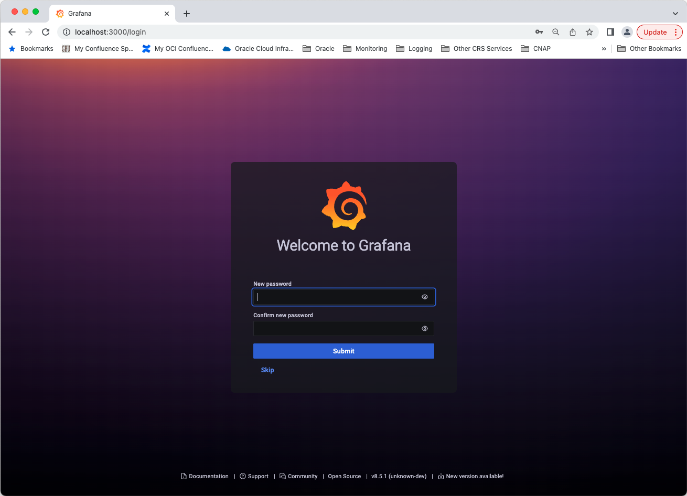

# Local Installation (Linux) - Oracle Cloud Infrastructure Data Source for Grafana 

## Background

Grafana is a popular technology that makes it easy to visualize logs and metrics. The [Oracle Cloud Infrastructure Logs Data Source for Grafana](https://grafana.com/grafana/plugins/oci-logs-datasource/) is used to extend Grafana by adding OCI Logging as a data source. The plugin enables you to visualize log records (service, audit, and custom) and metrics derived from log records stored in the OCI Logging service.

This walkthrough is intended for use by people who would like to deploy Grafana and the OCI Logs Data Source for Grafana on a local Linux server. 

Make sure you have access to the [Logging Service](https://docs.oracle.com/en-us/iaas/Content/Logging/Concepts/loggingoverview.htm) and that the logs you want to observe and analyze are being collected in your tenancy. See the OCI Logging documentation for information on how to collect or access:
* [Logs from your compute instances](https://docs.oracle.com/en-us/iaas/Content/Logging/Concepts/agent_management.htm)
* [Custom logs from your application/services](https://docs.oracle.com/en-us/iaas/Content/Logging/Concepts/custom_logs.htm)
* [OCI service logs](https://docs.oracle.com/en-us/iaas/Content/Logging/Concepts/service_logs.htm).

## Install the Oracle Cloud Infrastructure CLI 

The [Oracle Cloud Infrastructure CLI](https://docs.cloud.oracle.com/iaas/Content/API/Concepts/cliconcepts.htm) provides you with a way to perform tasks in OCI from your command line rather than the OCI Console. It does so by making REST calls to the [OCI APIs](https://docs.cloud.oracle.com/iaas/Content/API/Concepts/usingapi.htm). We will be using the CLI to authenticate between our local environment hosting Grafana and OCI in order to pull in logs. The CLI is built on Python (version 2.7.5 or 3.6 or later), running on Mac, Windows, or Linux.

Begin by [installing the Oracle Cloud Infrastructure CLI](https://docs.cloud.oracle.com/iaas/Content/API/SDKDocs/cliinstall.htm). Follow the installation prompts to install the CLI on your local environment. After the installation is complete, use the `oci setup config` command to have the CLI walk you through the first-time setup process. If you haven't already uploaded your public API signing key through the console, follow the instructions [here](https://docs.us-phoenix-1.oraclecloud.com/Content/API/Concepts/apisigningkey.htm#How2) to do so. 

After the CLI has been configured, move the `~/.oci` folder to `/usr/share/grafana` and then change ownership of the `/usr/share/grafana/.oci folder` to the “grafana” user: `sudo chown -R grafana:grafana /usr/share/grafana/.oci`. 

## Configure OCI Identity Policies

In the OCI console under **Identity > Groups** click **Create Group** and create a new group called **grafana**. Add the user configured in the OCI CLI to the newly-created group. 


Under the **Policy** tab click **Create Policy** and create policies allowing the group to read tenancy log objects and content. Add the following policy statements:

- `allow group grafana to read read log-groups in tenancy`
- `allow group grafana to read log-content in tenancy`
- `allow group grafana to read compartments in tenancy`


The first two policies can also be limited to specific compartments in your tenancy by adding additional qualifiers to the policy statements.

## Install Grafana and the OCI Logs Data Source for Grafana Plugin 

To [install the OCI Logs data source](https://grafana.com/plugins/oci-logs-datasource/installation) make sure you are running [Grafana 8.0](https://grafana.com/get) or later. Use the [grafana-cli tool](http://docs.grafana.org/plugins/installation/) to install the Oracle Cloud Infrastructure Logs Data Source for Grafana from the command line:

```
grafana-cli plugins install oci-logs-datasource
```

The plugin will be installed into your Grafana plugins directory, which by default is located at /var/lib/grafana/plugins. [Here is more information on the CLI tool](http://docs.grafana.org/plugins/installation/).

### Manual installation 
Alternatively, you can manually download the .tar file and unpack it into your /grafana/plugins directory. To do so, change to the Grafana plugins directory: `cd /usr/local/var/lib/grafana/plugins`. Download the OCI Grafana Plugin: wget `https://github.com/oracle/oci-grafana-logs/releases/latest/download/plugin.tar`. Create a directory and install the plugin: `mkdir oci && tar -C oci -xvf plugin.tar` and then remove the tarball: `rm plugin.tar`. 

>  **Additional step for Grafana 8**. Open the grafana configuration  *grafana.ini* file and add the `allow_loading_unsigned_plugins = "oci-logs-datasource"`in the *plugins* section.

*Example* 
```
    [plugins]
    ;enable_alpha = false
    ;app_tls_skip_verify_insecure = false
    allow_loading_unsigned_plugins = "oci-logs-datasource"
```

To start the Grafana server, run: `sudo systemctl start grafana-server`. 


## Configure Grafana

The next step is to configure the plugin. Navigate to the Grafana homepage at `http://localhost:3000`


Log in with the default username `admin` and the password `admin`. You will be prompted to change your password. Click **Skip** or **Save** to continue. 



On the Home Dashboard click the gear icon on the left side of the page and then select **Data sources** from the Configuration menu.


Click **Add data source**.


In the search box at the top of the resulting page, enter 'oracle'.


 Click the **Oracle Cloud Infrastructure Logs** box to select it as your data source type.


On the Oracle Cloud Infrastructure Logs data source configuration page, fill in your **Tenancy OCID**, **Default Region**, and **Environment**. Your **Default region** is the same as your home region listed in the **Tenancy Details** page. For **Environment** choose **OCI Instance**. 

Click **Save & Test** to test the configuration of the Logs data source. Click the Dashboard icon in the left hand navigation menu to return to the home dashboard.


## Next Steps

Check out how to use the newly installed and configured plugin in our [Using Grafana with Oracle Cloud Infrastructure Data Source](using.md) walkthrough. 

