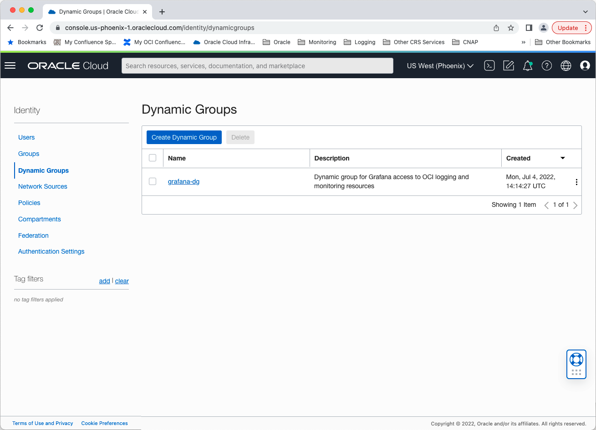
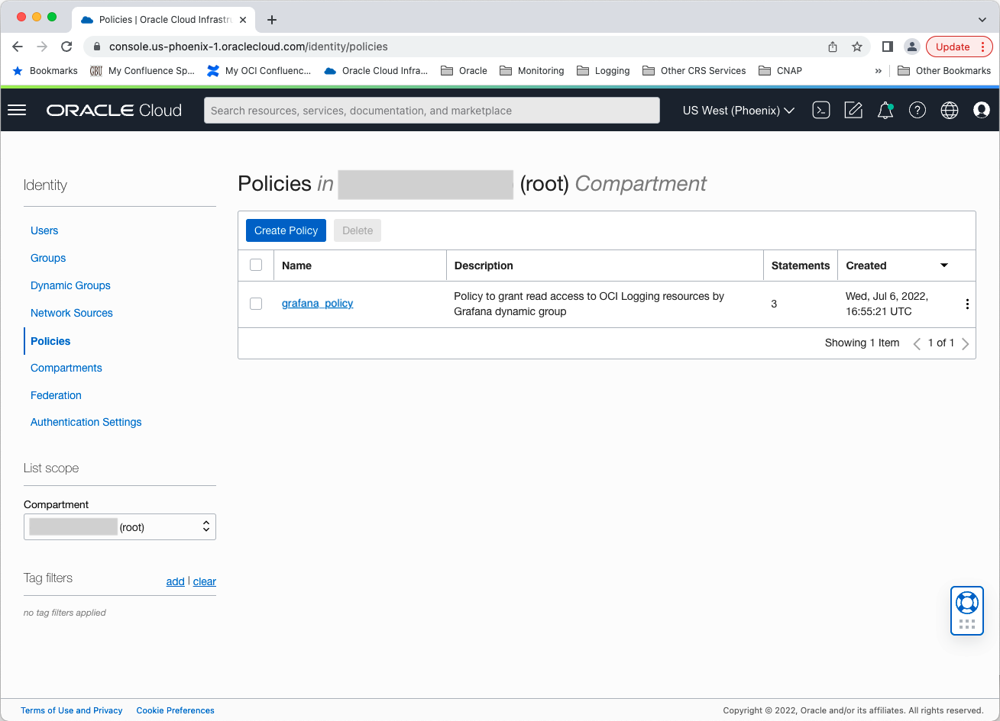
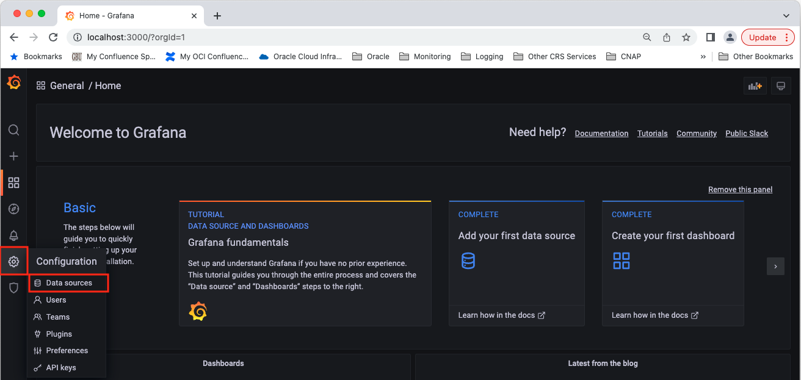
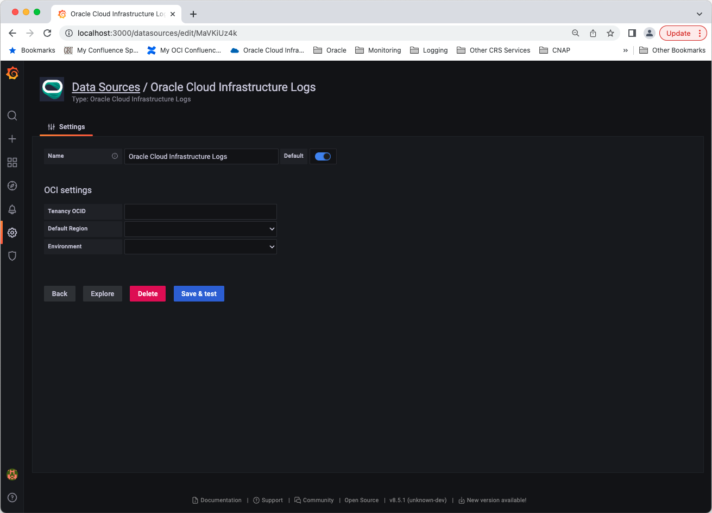

# OCI Virtual Machine Installation - Oracle Cloud Infrastructure Data Source for Grafana   

## Background

Grafana is a popular technology that makes it easy to visualize logs and metrics. The [Oracle Cloud Infrastructure Logs Data Source for Grafana](https://grafana.com/grafana/plugins/oci-logs-datasource/) is used to extend Grafana by adding OCI Logging as a data source. The plugin enables you to visualize log records (service, audit, and custom) and metrics derived from log records stored in the OCI Logging service.

This walkthrough is intended for use by people who would like to deploy Grafana and the OCI Logs Data Source for Grafana on a virtual machine in OCI. 

Make sure you have access to the [Logging Service](https://docs.oracle.com/en-us/iaas/Content/Logging/Concepts/loggingoverview.htm) and that the logs you want to observe and analyze are being collected in your tenancy. See the OCI Logging documentation for information on how to collect or access:
* [Logs from your compute instances](https://docs.oracle.com/en-us/iaas/Content/Logging/Concepts/agent_management.htm)
* [Custom logs from your application/services](https://docs.oracle.com/en-us/iaas/Content/Logging/Concepts/custom_logs.htm)
* [OCI service logs](https://docs.oracle.com/en-us/iaas/Content/Logging/Concepts/service_logs.htm).

## Create the Grafana Environment in OCI 

Provision an Oracle Linux [virtual machine](https://docs.cloud.oracle.com/iaas/Content/Compute/Concepts/computeoverview.htm) in OCI connected to a [Virtual Cloud Network](https://docs.cloud.oracle.com/iaas/Content/Network/Tasks/managingVCNs.htm) with access to the public internet. If you do not already have access to a Virtual Cloud Network with access to the public internet you can navigate to **Virtual Cloud Networks** under **Networking** and click **Create Virtual Cloud Network**. Choosing the `CREATE VIRTUAL CLOUD NETWORK PLUS RELATED RESOURCES` option will result in a VCN with an Internet Routing Gateway and Route Tables configured for access to the public internet. Three subnets will be created: one in each availability domain in the region.

After creating your VM, the next step is to create a [dynamic group](https://docs.cloud.oracle.com/iaas/Content/Identity/Tasks/managingdynamicgroups.htm) used to group virtual machine or bare metal compute instances as “principals” (similar to user groups). 

   

Next, create a [policy](https://docs.cloud.oracle.com/iaas/Content/Identity/Concepts/policygetstarted.htm), for example named “grafana_policy”, in the root compartment of your tenancy to permit instances in the dynamic group to make API calls against Oracle Cloud Infrastructure services. Add the following policy statements:

* `allow dynamicgroup grafana to read read log-groups in tenancy`
* `allow dynamicgroup grafana to read log-content in tenancy`
* `allow dynamicgroup grafana to read compartments in tenancy`

   

The first two policies can also be limited to specific compartments in your tenancy by adding additional qualifiers to the policy statements.

## Install Grafana and the OCI Logs Data Source for Grafana Plugin 

To [install the OCI Logs data source](https://grafana.com/plugins/oci-logs-datasource/installation) make sure you are running [Grafana 8.0](https://grafana.com/get) or later. Use the [grafana-cli tool](http://docs.grafana.org/plugins/installation/) to install the Oracle Cloud Infrastructure Logs Data Source for Grafana from the command line:

```
grafana-cli plugins install oci-logs-datasource
```

The plugin will be installed into your Grafana plugins directory, which by default is located at /var/lib/grafana/plugins. [Here is more information on the CLI tool](http://docs.grafana.org/plugins/installation/).

### Manual installation 
Alternatively, you can manually download the .tar file and unpack it into your /grafana/plugins directory. To do so, change to the Grafana plugins directory: `cd /usr/local/var/lib/grafana/plugins`. Download the OCI Logs Grafana Plugin: wget `https://github.com/oracle/oci-grafana-logs/releases/latest/download/plugin.tar`. Create a directory and install the plugin: `mkdir oci && tar -C oci -xvf plugin.tar` and then remove the tarball: `rm plugin.tar`. 

>  **Additional step for Grafana 8**. Open the grafana configuration  *grafana.ini* file and add the `allow_loading_unsigned_plugins = "oci-logs-datasource"`in the *plugins* section.

*Example* 
```
    [plugins]
    ;enable_alpha = false
    ;app_tls_skip_verify_insecure = false
    allow_loading_unsigned_plugins = "oci-logs-datasource"
```

To start the Grafana server, run: `sudo systemctl start grafana-server`. 


## Configure Grafana

The next step is to configure the plugin. To find the IP address of the newly-created instance, navigate to Compute > Instances > [Your Instance]. The Public IP address is listed under the Primary VNIC Information section. Connect to Grafana via port forward by running `ssh opc@[Instance Public IP] -L 3000:localhost:3000`. 

Navigate to the Grafana homepage at http://localhost:3000.


Log in with the default username `admin` and the password `admin`. You will be prompted to change your password. Click **Skip** or **Save** to continue. 


On the Home Dashboard click the gear icon on the left side of the page and then select **Data sources** from the Configuration menu.



Click **Add data source**.


In the search box at the top of the resulting page, enter 'oracle'.


 Click the **Oracle Cloud Infrastructure Logs** box to select it as your data source type.


On the Oracle Cloud Infrastructure Logs data source configuration page, fill in your **Tenancy OCID**, **Default Region**, and **Environment**. Your **Default region** is the same as your home region listed in the **Tenancy Details** page. For **Environment** choose **OCI Instance**. 

Click **Save & Test** to test the configuration of the Logs data source. Click the Dashboard icon in the left hand navigation menu to return to the home dashboard.



## Next Steps

Check out how to use the newly installed and configured plugin in our [Using Grafana with Oracle Cloud Infrastructure Data Source](using.md) walkthrough. 
