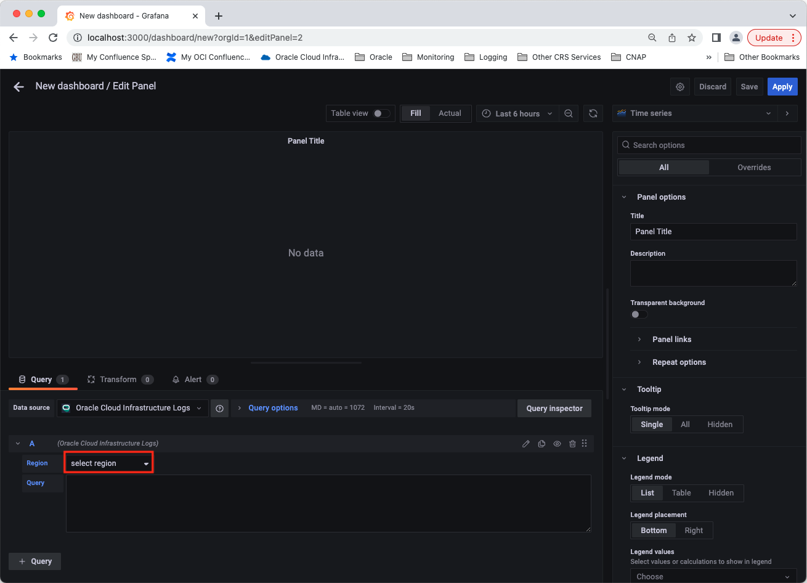
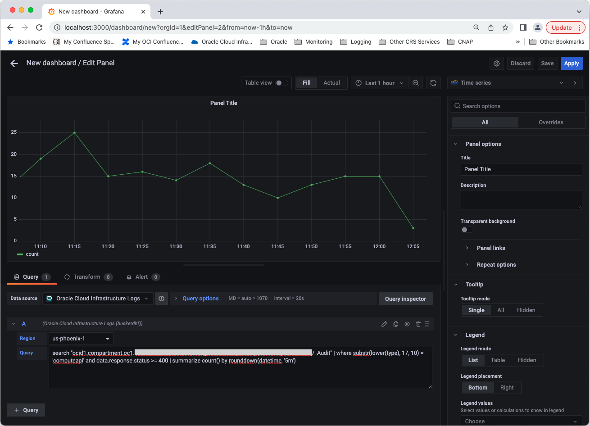
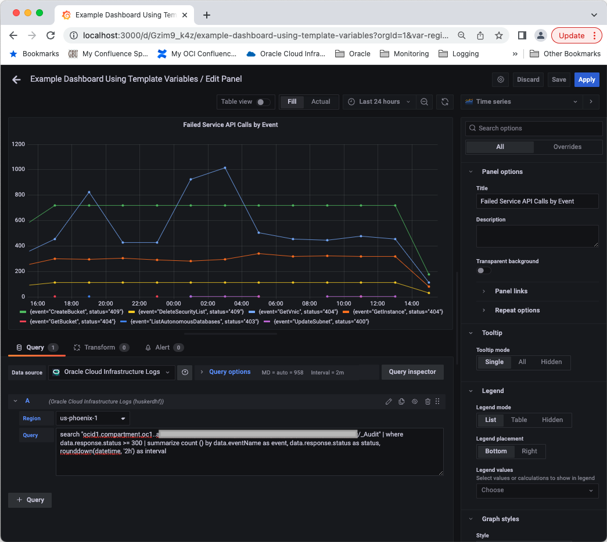

# Using Grafana with the Oracle Cloud Infrastructure Logs Data Source 

Here are a few capabilities for you to explore after installing and configuring the Oracle Cloud Infrastructure Logs Data Source for Grafana. Refer to the [OCI Logging service documentation](https://docs.oracle.com/en-us/iaas/Content/Logging/Concepts/loggingoverview.htm) for more information about how to use the Logging Service. Since all data panels that use the OCI Logs data source will require the definition of a Logging search query, see the [Logging Query Language Specification](https://docs.oracle.com/en-us/iaas/Content/Logging/Reference/query_language_specification.htm) for more information on the Logging query language capabilities and syntax.

## Logging Search Queries

The OCI Logging search query language is powerful and flexible and can return two types of information based on the searched log records:
- A set of log records that match any specified filtering criteria in the logging search query.
    - This type of log search results is useful when you want to observe logs related to a specific issue or produced by a specific application or service.
- Metric values derived from the information in the searched log records. The Logging search query language supports five mathematical functions (count, sum, avg, min, & max) and when one of these functions is used in a logging search query then the returned results contain the computed metric values based on the query.
    - Additionally if the logging search query groups the results using the `rounddown()` function then the returned query results contain a set of metrics over a set of time intervals. This type of data is typically referred to as time series metric data.
    - This type of log search results is useful when you want to visualize information derived from searched log records such as occurrences of logs containing error messages, distribution of HTTP response codes returned by an API, or data computed from a log record field containing numeric data.

The OCI Logs data source supports the use of logging search queries that return either of these logging search result types. However, how one visualizes these two types of logging search results is very different in Grafana and so the visualization of the two logging search result types will be addressed separately.

## Query Editor

The OCI Logs data source plugin provides a query editor that allows the creation of data panels that will allow users to observe and visualize data from your Oracle Cloud Infrastructure logs. The query editor for the OCI Logs data source can be used from two locations within Grafana:
- The Explore window which is accessible by hovering over the compass icon in the left hand navigation tool bar and then clicking the **Explore** menu item.
- The dashboard editor window which is accessible by hovering over the plus icon in the left hand navigation tool bar and then clicking the **Dashboard** menu item.

The remainder of this section will focus on how to use the OCI Logs data source query editor within the dashboard editor but the same basic steps apply in Grafana Explore window.

No matter which type of results are returned by a logging search query, the majority of the steps for creating a data panel using the OCI Logs data source are the same and covered in the steps that follow. The specifics of how to visualize the two types of logging search results described above will be addressed in separate sub-sections below.

From any window in Grafana, hover over the plus icon in the left hand navigation tool bar and then click the **Dashboard** menu item.

On the New dashboard window, click the **Add a new panel** box.

Select the Oracle Cloud Infrastructure Logs data source as the data source to be used for the new panel if it is not already selected.

By default the new panel editor uses the Time Series panel type by this can be changed in the upper right hand corner of the editor.

Grafana data panels have a large number of configuration options that can be controlled through the panel configuration sub-pane on the right hand side of the window. For example, you can set the title for the panel by selecting in the Panel Title text box and entering an appropriate panel title.

Choose the appropriate **Region** from the list of available options by clicking on the region dropdown. The selection can be either a specific OCI region identifier or a region related template variable. See the Templating section for more information on template variables.

Click in the Query box and enter the text for the logging search query that will return the data that you want to observe or visualize.

To save the changes you have made to a data panel, click the Apply button in the top right hand corner of the editor window.

**NOTE**: The Grafana data panels provide a wide range of configuration customization options related to panel presentation, header & footer, thresholds, options related to the specific panel type, etc. See the [Grafana data panel documentation](https://grafana.com/docs/grafana/latest/panels/) for more information on the available configuration options.

### Visualizing Log Records

When visualizing a set of log records that are returned by a logging search query the results can conceptually be thought of as a table of results where each log record is a row in the table and each field in the log records is a column in the table. Thus if you plan on creating a data panel that will present a set of log records returned by a logging search query it is recommended that you set the panel type to **Table** by selecting the **Table** dropdown element.

The resulting data will be presented in tablular format where only the top level fields of the log records are displayed.

Many log records contain one or more fields that contain structured data, e.g. JSON data, which in turn contain many more fields that you may also want to display in the table visualization. By default these structured data fields are not parsed and included in the table data. However Grafana provides powerful options for transforming such log record fields so those additional fields can be included in the table. To use the data transformation capabilities of Grafana select the Transform tab.

Scroll down through the list of transform options and click the **Extract fields** row.

Click the Source dropdown selection and select the log record field to be transformed such as the **data** field in this example.

If needed you can also set the format option for the transformation to specify the format of the data within the selected field. Click the format dropdown selection and click the applicable option. For fields containing JSON data, setting the format selection to either **Auto** or **JSON** should work.

If you scroll to the right within the table, the table now includes all of the additional fields extracted from the selected log record field.

See the [Transform data](https://grafana.com/docs/grafana/latest/panels/transform-data/) section of the Grafana documentation for more information about all of the available data transformation options.

Within a Table panel, you can also identify fields you want to hide or change the order in which the fields are presented in the table. See the [Table](https://grafana.com/docs/grafana/latest/visualizations/table/) section of the Grafana documentation for more information on the panel customziation options for the Table data panel type.

Once you have made all the updates to the transform and table configuration options, click the **Apply** button in the upper right hand corner of the panel editor and your dashboard now contains a Table visualization that allows a user to view a set of log records that match a defined search criteria.

### Visualizing Metrics Derived from Log Records

When you want to visualize numeric or metric data derived from a set of log records that are returned by a logging search query such as:
- A count of the number of log records that meet a specified criteria, such as containing an error message or a specific HTTP response code.
    - This is done using the `count()` function of the Logging search query language.
- The sum, average, minimum, or maximum value computed for a numeric field within the log records that meet a specific criteria.
    - This is done using the `sum()`, `avg()`, `min()`, and `max()` functions, respectively, of the Logging search query language.
    - The type of data you are trying to visualize is different from a set of log records and very often is time series data, that is values for one or more metrics across a set of consecutive time intervals.

So while a **Table** panel type makes sense for a set of log records, one of the following Grafana panel types is typically going to be more appropriate for this type of time series data:
- Time series
- Bar chart
- Stat
- Gauge
- Bar Gauge
- Heatmap

Which of these panel types is most appropriate for will depend on the type of metric data returned by the query and how you prefer to have that data presented to users of the resulting dashboard.

After entering the logging query that will return numeric data in the **Query** box of the Edit Panel window and clicking outside the **Query** box, the logging query will be performed and the resulting data presented in the graph.

Once you have made all the updates to the data panel, click the **Apply** button in the upper right hand corner of the panel editor and your dashboard now contains a visualization that allows a user to visualize the log-based metrics generated by your specified search query.

#### Options for Visualizing Log-based Time Series Data

If you have a working Logging search query and add an element to count the number of log records, `<Existing logging query> | summarize count()`, the query will return a single count value for the selected time period. In some cases this may be exactly what you want but if you want to visualize that count value over a selected time range then that query by itself is not sufficient. The OCI Logs data source provides two different ways for such a query to be presented as a time series.

The **first and recommended option** is to use the `rounddown()` function of the Logging query language within the logging query specified in the data panel so the Logging service automatically generates time series data for the generated metrics. The `rounddown()` function is generally used in a manner similar to the following:
- `rounddown(datetime, '<interval>')` where `<interval>` is a string value such as 5m, 10m, 15m, 30m, 1h, 12h, 1d, etc.
The interval value specified in the `rounddown()` function identifies the time interval to be used by the Logging service when computing the metrics for the logging query.

In the simplest case the `rounddown()` function is added to the end of logging query:
- `<Existing logging query> | summarize count() by rounddown(datetime, '5m')`
where the actual interval used will be dependent on your use case. With this element added, the query will return time series data with the count metric for N time intervals. In the following example since the selected time period for the query is 1 hour and the time interval in the `rounddown() function` is 5m, the query returns 12 data points for the count metric which are plotted on the resulting graph.

The second option is to not specify the `rounddown() function as part of the logging query specified in the data panel in which case the OCI Logs data source will run the specified logging query over multiple intervals within the selected time period to effectively generate time series data for the metric(s) returned by the query. With this option control over the time interval used is more involved where by default the OCI Logs plugin will run the specified query to generate 10 data points across the selected time period.

If you want to change the number of data points rendered in the data panel then you can change the **Max data points** setting in the Query  Options element of the data panel editor. The range of valid maximum data points values is 1-10, inclusive, if a value outside this range is specified then the OCI Logs data source will use a value of 10 for the maximum number of data points for the graph.

So if for the previous query the maximum number of data points is changed to 5 then the rendered graph will have 5 data points rather than 10.

As mentioned above, the first option is the recommended approach if you want to visualize time series metric data from your log data since the resulting graphs will be rendered faster, less load is applied to the Logging service, and it is easier to control the time interval over which the time series data is computed.

#### Logging Query Options

This page does not cover all of the possible aspects of the Logging query language, for those details you should see the [Logging Query Language Specification](https://docs.oracle.com/en-us/iaas/Content/Logging/Reference/query_language_specification.htm). However several commonly used aspects of the Logging query language that are worth noting are the ability to group metric results by one or more log record fields and to use aliases within a logging query in a data panel. This section covers the use of those two aspects of the logging query language within a data panel using the OCI Logs data source.

With the group by capability of the logging query language, you can group results by any characteristic that is meaningful to you and which is represented by a field within the searched log records. For example, in an OCI tenancy you might want to generate a count of Compute API requests in the tenancy that had a non-success status code then group those results by the event name in the Audit log records. This will allow a user to quickly identify which, if any, Compute API calls have had the most errors over a time period. Such a query might take the following form:
- `<Logging query that identifies log records with errors> | summarize count() by data.eventName, rounddown(datetime, '1h')`
Note that this group by criteria in the query is in addition to the rounddown() function which causes the Logging service to return time series data.

This example groups the query results on only one field (not including the time interval specified by the `rounddown()` function). However the specified logging query can have multiple fields referenced. Consider the following graph where the previous query has been augmented to also group the results by the status code returned by the relevant API calls.

In addition the grouped by fields can contain either numeric or string data and referenced in whichever order is most relevant for your use of the generated metric data.

Another aspect of the Logging query language that can be used in logging queries within data panels supported by the OCI Logs data source are field aliases. Logging queries can include an alias definition for one or more of the returned elements using `as <alias name>` after the field reference. Aliases can be defined for the computed metric, any of the grouped by fields, as well as the time interval. For example, the prior logging query example could be extended to include aliases for each of the resulting fields and the result would be similar.

The use of aliases within logging queries is primarily a convenience in case you have working Logging queries that already include aliases then there is no need to remove those aliases from the query when used in a Grafana data panel. In addition as shown in the previous screenshot, by specifying aliases for the grouped by fields you can also control how those fields are identified in the legend values for the metrics.

## Templating 

Templating provides the ability for a dashboard user to dynamically select or update the information used to drive the generation of the visualizations on a dashboard without making any changes to the dashboard. This is done through template variables that provide the values to dropdown selections on a dashboard such as the region dropdown in the following screenshot. 

In order to configure templating for a dashboard, click on the gear icon in the upper right portion of the toolbar at the top of the dashboard editor page.

This will take you to the **Dashboard Settings** page, click on the **Variables** tab along the left hand side of the screen.

Finally click the **Add variable** button on the next page. 

Add the **region** variable to this page. Enter `region` for the variable in the **Name** field, enter `Region` in the **Label** field, enter an optional description such as `OCI Region selection` in the Description field, choose **Oracle Cloud Infrastructure Logs** from the list of data sources, and in the **Query** field enter `regions()`. Click outside the **Query** field and the list of possible region values should appear in the Preview section at the bottom of the page.

Click **Variables** within the `Variables > Edit` text at the top of the screen to return to the template variables list page.

Back on the **Variables** screen, click the **New** button in the upper right hand corner of the window to create another template variable. Or click the back arrow in the top left hand corner of the window to return to the dashboard editor page.

Repeat the process for the following OCI variables: 

| Name            | Query                                                                     |
| --------------- | ------------------------------------------------------------------------- |
| region          | `regions()`                                                               |
| compartment     | `compartments()`                                                          |

**NOTE**: The use of a compartment template variable within the logging query in a logs data panel is not currently supported.

The final list of variables should look like this: 

If you plan to visualize log-based time series metrics using the `rounddown() function` within logging queries then you optionally can define an additional **interval** template variable that defines an appropriate list of interval values from which a dashboard user can select.

This template variable can be useful to dynamically control the time interval used when performing the logging search queries in the data panels on the dashboard. If for example the user changes the time period for the dashboard to be for the last 24 hours, they can change the interval template variable selection to say `1h` since a very granular time interval such as `5m` would lead to too many data points being generated.

### Using Template Variables with OCI Logs Data Panels

Once a template variable is defined for the dashboard you can reference it using a template variable placeholder, `$<template variable name>` within the data panels on the dashboard. Consider the OCI Logs data panel shown in the following screenshot that currently has hard-coded values for the OCI region and the time interval used for the query.

To make the data panel and the dashboard overall more useful, you can replace the region and interval values with template variable placeholders.

Now a user of the dashboard can change the OCI region for which data is being displayed or update the time interval for the logging queries used in the data panels on the dashboard without making any modification to the dashboard or its data panels.

While the above process for creating and using template variables is focused on the template variables supported by the OCI Logs data source, depending on your environment you may have other data sources that you have defined in Grafana. And you may define template variables on your dashboards using those additional data sources. These template variables from other data sources can also be referenced within the data panels of the dashboard that rely on the OCI Logs data source. For example you may have another data source that provides a list of Kubernetes namespaces for the environment that is being monitored and define a **k8s_namespace** template variable that provides a selectable list of Kubernetes namespaces from the environment. If you have a logging query on one or more of the data panels that filters the queried log results by a specific Kubernetes namespace name, `... | where data.namespace = '$k8s_namespace'` then you could reference this **k8s_namespace** template variable from the other data source within your OCI Logs data panels.

**NOTE**: Currently the use of template variables within OCI Logs data panels is limited to a singleton selection. This means that when template variables supported by the OCI Logs data source are defined the **Multi-value** and **Include all option** radio buttons need to be disabled on the template variable configuration page.

Support for template variables that can have multiple values or a wildcard for 'all' values will be considered as a future enhancement for the OCI Logs data source plugin. 
